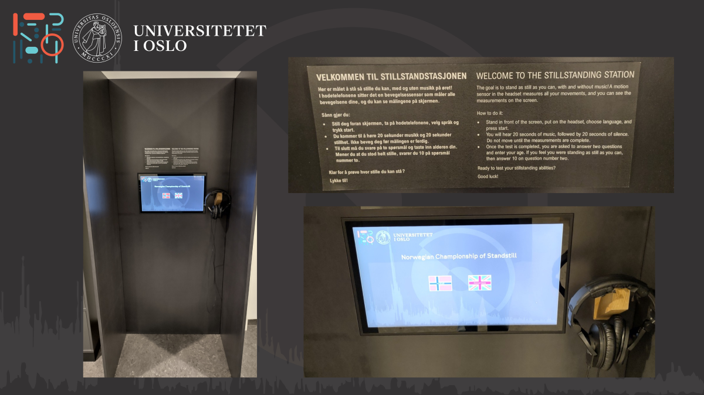
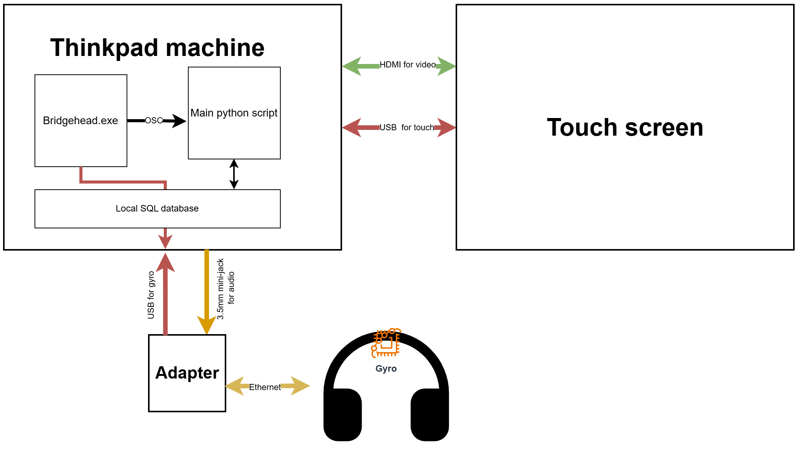

# The Standstill Station

<div align="left">
 
</div>
</br>

The Standstill station is an art-science installation that hosts the Norwegian championship of Standstill, a challenge to see who can move the least. Users put on a pair of headphones and are asked to stand still for 40 seconds while listening to music and silence. The movements are tracked by a small gyro placed inside the headphones, and the movement data is displayed to the user on screen in real-time. After each trial, users can see how well they perform compared to all previous participants.

The exhibit was originally developed by Joachim Poutaraud, Julius Jacoby-Pflug, and Alexander Jensenius in 2023, as part of a collaboration between [RITMO Centre of Excellence](https://www.uio.no/ritmo/english/) at the University of Oslo and the [Popsenteret museum](https://www.popsenteret.no/) in downtown Oslo. In 2026, after Popsenteret sadly closed, the installation was updated and revitalized at the [Department of Musicology](https://www.hf.uio.no/imv/english/) at the University of Oslo by Aleksander Tidemann.

This repo contains all the software and the official documentation for the Standstill station, anno 2026.

# System overview

The system consists of a large physical structure, a touchscreen computer, and a pair of headphones with a gyroscope inside. The wooden structure is custom-made and places the user inside a half-box, creating an immersive space that allows for focused attention. All electronics are fastened to the back of the structure. Only the headphones, touchscreen, and documentation plaque are visible. 

The headphones-gyro hybrid is also a custom-made device where a small gyro is hidden inside the headband of a pair of headphones. Their cables are also intertwined and run through an encompassing cable, so all you see is a clean pair of headphones with an unusual Ethernet connector at the end. The Ethernet port adapter effectively separates the gyro and audio signals, again, so they can be connected to the computer via USB-A and mini-jack (3.5mm).

All the system software runs inside a small ThinkPad M70q Windows 10 desktop machine mounted on the back of the structure. Software-wise, the standstill station requires three programs:

1. The main Python script ```./main.py``` that handles the UI, data, calculations, and database storage, etc.
2. A bridge application ```./Bridgehead.exe``` that converts and sends the 3D head-tracking data (XYZ) from the gyro to the main Python script via OSC.
3. A local SQL database for handling data.

<div align="left">
 
</div>
</br>

# Installation

1. Download Python v3.11
2. Download SQL and initialize a server-client database.
3. Download Bridgehead v1.19
4. Open Terminal and run:

```
> cd PATH_TO_STANDSTILL_STATION_FOLDER
> pip install -r requirements.txt
```

# How to Run

To be able to run the standstill code, basically, ensure that:

1. The SQL server is configured to run in the background on boot. This is default with local installations, I think. But good to check anyways. 
3. Run the bridge application ```./Bridgehead.exe``` and ensure that the “Quaternion (composite)” profile is selected under setting, and that the tracking rate is set to 10kHz. This enables the app to send the XYZ gyro data to the Python script over OSC port 8000. To reset the gyro calibration, place the headphones is the correct zero-position and double-click the red head in the bridgehead app interface.
4. That "Speakers" is selected as the speaker source in Windows audio settings. Yes, this bring audio to the headphones. For some reason. It should be automatic when headphones are connected, but good to check anyways. 

Finally, open the Terminal and run:
```
> cd PATH_TO_STANDSTILL_STATION_FOLDER
> python main.py
```

## Startup Routine

On the installation machine itself, further steps are taken so that the standstill application can run smoothly for weeks and months on end (at least in theory). First, the main Windows user is set to log in automatically on boot (no password or anything required). Second, all Windows sleep/power settings are turned off so the machine never goes to sleep. Finally, two recurring tasks are created, ensuring that the machine reboots every night (at 3:00am) and that the main Python script (main.py) starts automatically when the machine boots. The reboot is necessary to clear memory and mitigate freezes that _will_ occur at some point.

There are many ways to schedule recurrent tasks in Windows, but I thought it best to do this through Windows' native Task Scheduler. To locate this software, it's easiest to right-click on the Windows icon and launch the Computer Management app. To run the main Python script on boot, create a new task that runs a Program whenever the system "logs in", so just after a reboot. Then, specify the full path to your Python interpreter in the "Program" box and the full path to the main.py script in the "Arguments" box. It can also be useful to set the full path to the standstill folder in the “Starts in” box and encapsulate the commands in quotation marks. 

Finally, the Bridgehead application is also scheduled to run at boot. However, since this app is a full executable (.exe), a shortcut of the application is simply placed inside the Windows Startup folder. This is enough for Windows to run it whenever the machine starts. To locate the Startup folder, hit ```Win+r``` and write ```shell:startup```. 

# Development

In our case, the gyro adapter is stuck to the physical constructions and is therefore unattainable for development and testing elsewhere. However, you can use a simple script I made that simulates XYZ head-tracking movements over OSC for development. This is the ```./simulate_head_tracking_for_dev.py``` script located in the root folder. With this, there is no need for the adapter (gyro and headphones) or the Bridgehead application. Just run the OSC script, then the main Python script. 

Also, to check the database connection and make basic test queries, see the ```./sql-cheatsheet.py``` script in the root folder.

# Database Schema

The SQL database stores and retrieves data from the Standstill users. The server must be configured so that it runs in the background of the machine from boot. I just use SQL Workbench to set everything up. 

The database uses two table structures to store userdata, _standstillUser_ and _standstillRealTime_. Their schemas are as follows:

```
TABLE standstillUser 
(
id INT unsigned NOT NULL AUTO_INCREMENT,
standstillUserID INT unsigned,
age INT unsigned, 
language VARCHAR(2),
musicScore FLOAT, 
silenceScore FLOAT,
feedbackMusic INT unsigned,
feedbackStandstill INT unsigned,
PRIMARY KEY (id)
)
```

```
CREATE TABLE standstillRealTime 
(
id INT unsigned NOT NULL AUTO_INCREMENT,
standstillUserID INT unsigned,
genre VARCHAR(50),
date TIMESTAMP(6) NOT NULL DEFAULT CURRENT_TIMESTAMP(6),
w FLOAT(7,6) NOT NULL, 
PRIMARY KEY (id)  
)
```

All sensitive database information (usernames, passwords, etc.) is stored in a separate local ```./config.yml``` file. See the ```./config.example.yml``` file for info about how to set this up. Also, to check the database connection and make basic test queries, see the ```./sql-cheatsheet.py``` script in the root folder.

Good luck!

<div align="left">
 
</div>
</br>
